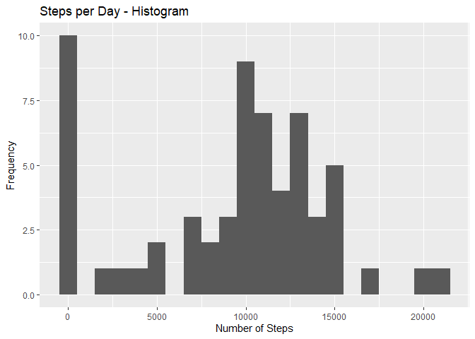
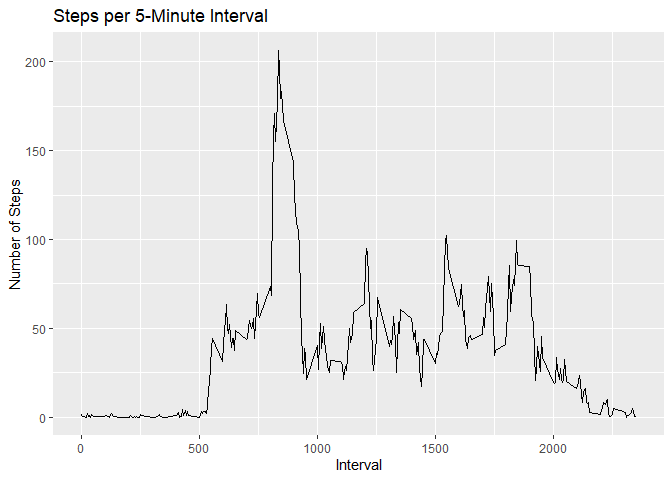
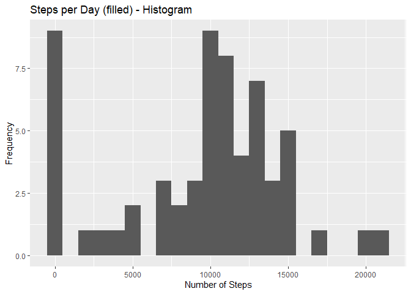
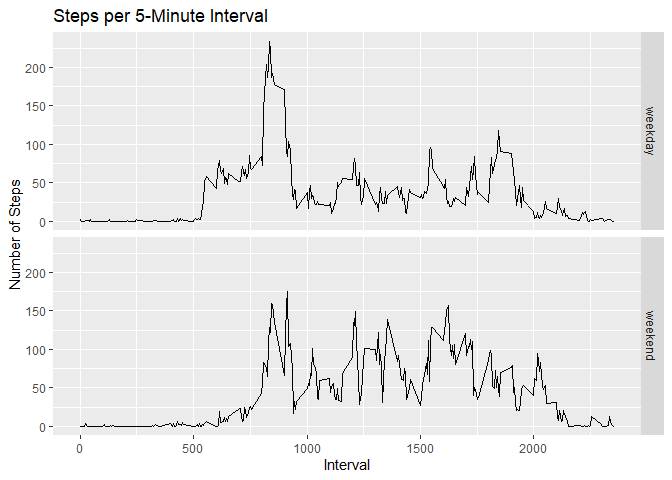

## Loading and preprocessing the data
The original data was downloaded from [this Link](https://d396qusza40orc.cloudfront.net/repdata%2Fdata%2Factivity.zip) and stored within this repository.

At first, load the data.

```r
  activity <- tibble(read.csv(unzip("activity.zip")))
  activity <- activity %>% mutate (date = ymd(date))
```

The variables included in this dataset are:

  * steps: Number of steps taking in a 5-minute interval (missing values are coded as NA)
  * date: The date on which the measurement was taken in YYYY-MM-DD format
  * interval: Identifier for the 5-minute interval in which measurement was taken


## Total number of steps per day
Calculate the total, the mean and median number of steps per day

```r
stepsDay <- activity %>% group_by(date) %>% summarize(sumSteps = sum(steps, na.rm=TRUE))
meanSteps <- round(mean(stepsDay$sumSteps))
medianSteps <- median(stepsDay$sumSteps)

ggplot(stepsDay, aes(x = sumSteps)) +
  geom_histogram(binwidth = 1000) +
  labs(title = "Steps per Day - Histogram", x = "Number of Steps", y = "Frequency") +
  theme_grey()
```

<!-- -->


The mean total number of steps per day is: *9354*   
The median total number of steps per day is: *10395*

## Daily activity pattern

```r
actPattern <- activity %>% group_by(interval) %>% summarize(meanSteps = mean(steps, na.rm=TRUE))

ggplot (data = actPattern, aes(x=interval, y=meanSteps)) +
  geom_line(linetype = "solid") +
  labs(title = "Steps per 5-Minute Interval", x = "Interval", y = "Number of Steps")
```

<!-- -->


```r
mi <- max(actPattern$meanSteps)
maxInterval <- as.character(actPattern[actPattern$meanSteps == mi,1])
```

The *835 5-minute interval*, on average across all the days in the dataset, contains the maximum number of steps


## Missing Values

```r
missingValues <- sum(is.na(activity$steps))
```
Replace *2304 NA* values within the dataset with the mean value of this interval.

```r
actList <- as.data.frame(actPattern)
activityFilled <- activity %>% mutate (steps = ifelse(is.na(steps), 
            actList[actList$interval == activity$interval, 2], activity$steps))
```

### Report the impact of imputing data

```r
stepsDayFilled <- activityFilled %>% group_by(date) %>% summarize(sumSteps = sum(steps, na.rm=TRUE))
meanStepsFilled <- round(mean(stepsDayFilled$sumSteps))
medianStepsFilled <- format(median(stepsDayFilled$sumSteps), digits=2, nsmall=0)
```
The mean total number of steps per day is now: *9531*   
The median total number of steps per day is now: *10439*


```r
ggplot(stepsDayFilled, aes(x = sumSteps)) +
  geom_histogram(binwidth = 1000) +
  labs(title = "Steps per Day (filled) - Histogram", x = "Number of Steps", y = "Frequency")
```

<!-- -->

The frequence for '0 steps' within the updated dataset is now lower, other frequency are higher.

## Differences in activity patterns between weekdays and weekends

```r
wdays = c(2,3,4,5,6)
activityFilledWday <- activityFilled  %>% mutate(weekday = ifelse (wday (date) %in% wdays, "weekday", "weekend"))
plotData <- activityFilledWday %>% group_by(weekday, interval) %>% summarize(meanSteps = mean(steps, na.rm=TRUE))

ggplot (data = plotData, aes(x=interval, y=meanSteps)) +
  geom_line(linetype = "solid") +
  labs(title = "Steps per 5-Minute Interval", x = "Interval", y = "Number of Steps") +
  facet_grid(weekday~.)
```

<!-- -->


